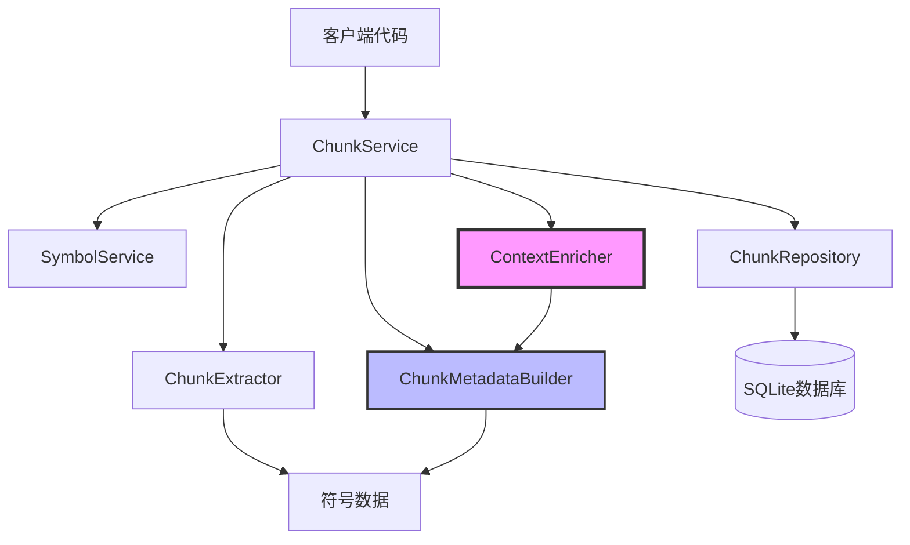
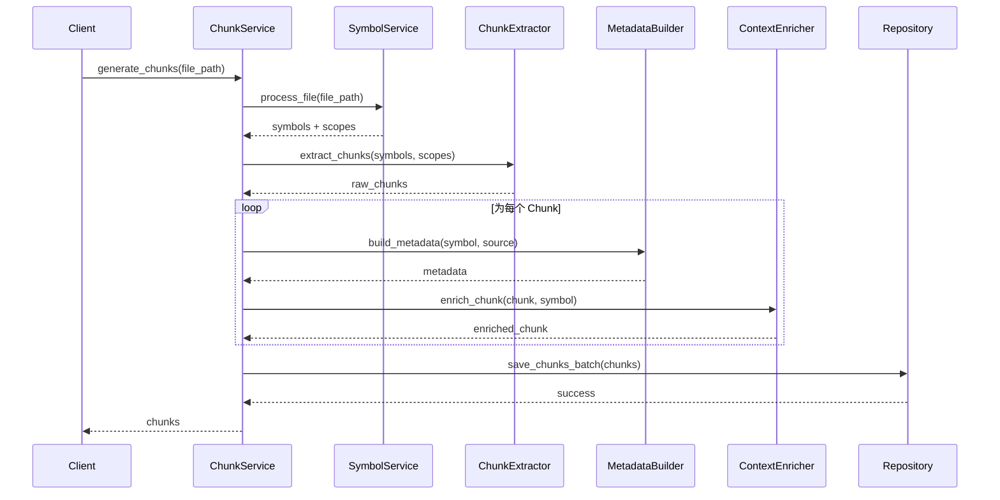
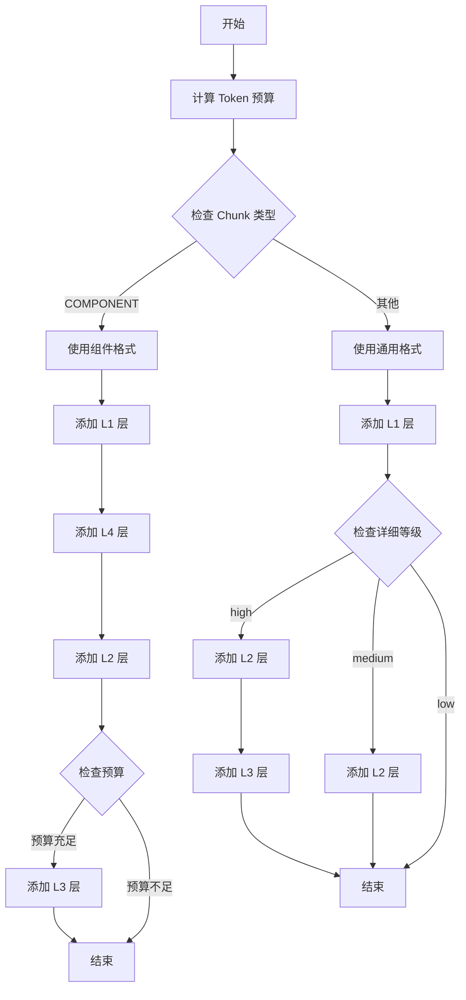
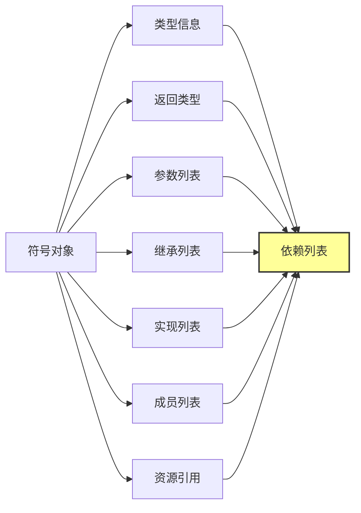
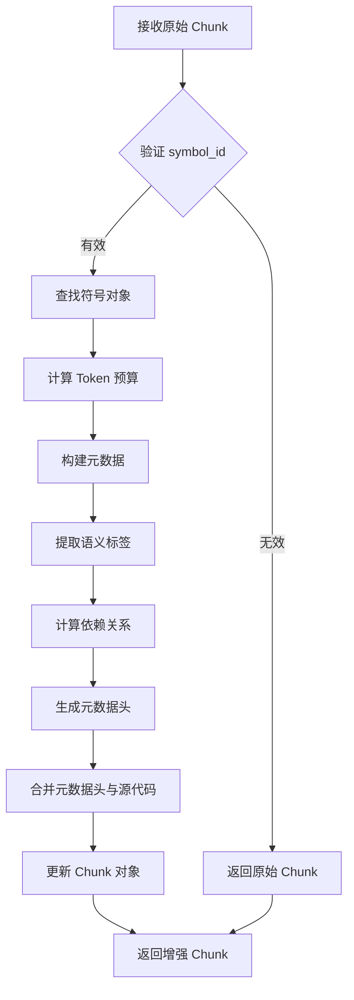

# 动态上下文控制方案 - 开发设计

## 概述

本文档定义了 **动态上下文控制方案** 的开发实现设计，该方案旨在为 ArkTS 代码处理平台的 Chunk 服务提供智能化的上下文增强能力。系统将根据代码块的大小和类型，动态调整上下文信息的详细程度，以优化 RAG 系统的检索效果。

### 设计目标

- 为小型 Chunk 提供丰富的上下文信息，提升召回准确性
- 为大型 Chunk 控制上下文冗余，避免噪声引入
- 支持 ArkUI 组件的特化元数据增强
- 提供分层元数据头策略，实现精细化的上下文控制
- 保持代码的可测试性和可维护性

### 技术约束

- 运行环境：Python 3.9+
- 依赖框架：tree-sitter, SQLAlchemy
- 集成系统：现有的 SymbolService 和 ChunkService
- 存储方式：SQLite 数据库

## 架构设计

### 系统组件关系

### 数据流转

## 核心功能模块

### 1. Token 预算计算模块

#### 功能定义

根据 Chunk 的源代码大小，计算其可用的上下文预算，决定元数据头的详细程度。

#### 输入输出规格

| 输入 | 类型 | 说明 |
|------|------|------|
| chunk_size | int | Chunk 源代码的 token 数量估算值 |

| 输出 | 类型 | 说明 |
|------|------|------|
| detail_level | str | 上下文详细等级（high/medium/low） |
| max_context_tokens | int | 最大上下文 token 数量 |
| include_siblings | bool | 是否包含兄弟节点信息 |
| include_parents | bool | 是否包含父节点信息 |

#### 预算策略表

| Chunk 大小（tokens） | 详细等级 | 最大上下文 tokens | 包含兄弟节点 | 包含父节点 |
|---------------------|---------|------------------|-------------|-----------|
| < 100 | high | 200 | ✓ | ✓ |
| 100-500 | medium | 100 | ✗ | ✓ |
| > 500 | low | 50 | ✗ | ✗ |

#### 业务规则

1. Token 估算采用简化算法：`word_count * 1.3`（考虑到代码中的符号和空格）
2. 上下文 token 预算不包含原始源代码的 token 数
3. 当 Chunk 类型为 COMPONENT 时，自动提升至 medium 等级（最低标准）

### 2. 分层元数据头生成模块

#### 功能定义

根据 Token 预算和 Chunk 类型，生成相应详细程度的元数据头。

#### 元数据头层级定义

**L1 层（必要层）** - 所有 Chunk 必须包含

| 字段 | 格式 | 示例 |
|------|------|------|
| file | `# file: {路径}` | `# file: src/utils/math.ts` |
| type | `# {类型}: {名称}` | `# function: calculate` |
| name | 符号名称 | calculate |

**L2 层（重要层）** - medium 及以上等级包含

| 字段 | 格式 | 示例 |
|------|------|------|
| context | `# class: {类名}` 或 `# module: {模块名}` | `# class: MathUtils` |
| imports | `# imports: [{依赖列表}]` | `# imports: [Math, Helper]` |
| tags | `# tags: [{标签列表}]` | `# tags: [async, public]` |

**L3 层（辅助层）** - high 等级包含

| 字段 | 格式 | 示例 |
|------|------|------|
| decorators | `# decorators: [{装饰器列表}]` | `# decorators: [@deprecated]` |
| visibility | `# visibility: {可见性}` | `# visibility: public` |
| return_type | `# type: {返回类型}` | `# type: Promise<User>` |

**L4 层（ArkUI 详细层）** - ArkUI 组件专属

| 字段 | 格式 | 示例 |
|------|------|------|
| component_type | `# component_type: {类型}` | `# component_type: Entry` |
| state_vars | `# state_vars: [{状态变量}]` | `# state_vars: [username: string]` |
| lifecycle_hooks | `# lifecycle_hooks: [{生命周期方法}]` | `# lifecycle_hooks: [aboutToAppear]` |
| event_handlers | `# event_handlers: [{事件处理器}]` | `# event_handlers: [onClick, onChange]` |

#### 生成流程

### 3. 语义标签提取模块

#### 功能定义

从符号的属性、类型和特征中提取多维度的语义标签，辅助向量检索和语义理解。

#### 标签分类体系

**维度 1：符号属性标签**

| 标签 | 条件 | 用途 |
|------|------|------|
| async | `symbol.is_async == true` | 标识异步函数 |
| static | `symbol.is_static == true` | 标识静态成员 |
| abstract | `symbol.is_abstract == true` | 标识抽象类/方法 |
| readonly | `symbol.is_readonly == true` | 标识只读属性 |

**维度 2：可见性标签**

| 标签 | 条件 | 用途 |
|------|------|------|
| public | `visibility == PUBLIC` | 公开接口 |
| private | `visibility == PRIVATE` | 私有实现 |
| protected | `visibility == PROTECTED` | 保护成员 |

**维度 3：符号类型标签**

| 标签 | 条件 | 用途 |
|------|------|------|
| ui-component | `symbol_type == COMPONENT` | ArkUI 组件 |
| entry | `@Entry` 装饰器存在 | 入口组件 |
| preview | `@Preview` 装饰器存在 | 预览组件 |
| function | `symbol_type == FUNCTION/METHOD` | 函数类型 |
| class | `symbol_type == CLASS` | 类类型 |

**维度 4：函数纯度标签**

| 标签 | 条件 | 用途 |
|------|------|------|
| pure-function | 无副作用判定 | 纯函数标识 |
| has-side-effects | 有副作用判定 | 副作用标识 |

**维度 5：ArkUI 特有标签**

| 标签 | 条件 | 用途 |
|------|------|------|
| lifecycle | 生命周期方法名匹配 | 生命周期标识 |
| event-handler | 包含事件处理器 | 事件处理标识 |
| has-state | 包含 @State 变量 | 状态管理标识 |

#### 标签提取优先级

1. 优先提取符号类型相关标签（维度 3）
2. 其次提取 ArkUI 特有标签（维度 5）
3. 再提取属性标签（维度 1 和 2）
4. 最后提取函数特性标签（维度 4）

### 4. 依赖关系追溯模块

#### 功能定义

从符号的类型信息、参数、继承关系等中提取依赖的外部符号，建立代码间的关联关系。

#### 依赖提取来源

#### 依赖提取规则

| 来源 | 提取规则 | 过滤条件 |
|------|---------|---------|
| 类型信息 | `symbol.type_info.name` | 排除 primitive 类型 |
| 返回类型 | `symbol.return_type.name` | 排除 primitive 类型 |
| 参数类型 | `param.type_info.name` for each param | 排除 primitive 类型 |
| 继承 | `symbol.extends` 列表 | 直接包含 |
| 实现 | `symbol.implements` 列表 | 直接包含 |
| 成员类型 | `member.type_info.name` for each member | 排除 primitive 类型 |
| ArkUI 资源 | `symbol.resource_refs` 列表 | 直接包含 |

#### Primitive 类型定义

- string, number, boolean, void, any, unknown, never
- Date, Array, Map, Set, Promise（基础内置类型）

### 5. 上下文增强协调模块

#### 功能定义

协调各个子模块，完成从原始 Chunk 到增强 Chunk 的完整流程。

#### 增强流程

#### 批量增强优化策略

1. **预构建映射表**：提前构建 `symbol_id -> symbol` 和 `scope_id -> scope` 的映射，避免重复查找
2. **并行处理**：对于独立的 Chunk，可以并行执行元数据构建和增强
3. **缓存复用**：同一作用域内的多个 Chunk 可以复用父级上下文信息

## 数据模型设计

### ChunkMetadata 扩展

当前已有的 ChunkMetadata 结构满足设计需求，包含：

| 字段 | 类型 | 说明 | 用途 |
|------|------|------|------|
| range | PositionRange | 位置范围 | 定位源代码 |
| decorators | List[str] | 装饰器列表 | 元数据头生成 |
| visibility | str | 可见性 | 标签提取 |
| parameters | List[Parameter] | 参数列表 | 依赖提取 |
| return_type | TypeInfo | 返回类型 | 依赖提取 |
| dependencies | List[str] | 依赖列表 | 关联查询 |
| tags | List[str] | 语义标签 | 检索优化 |
| component_type | str | 组件类型 | ArkUI 特化 |
| state_vars | List[Dict] | 状态变量 | ArkUI 特化 |
| lifecycle_hooks | List[str] | 生命周期方法 | ArkUI 特化 |
| event_handlers | List[str] | 事件处理器 | ArkUI 特化 |
| resource_refs | List[str] | 资源引用 | ArkUI 特化 |

### Token 预算配置结构

新增运行时配置结构（内存中使用，不持久化）：

| 字段 | 类型 | 默认值 | 说明 |
|------|------|-------|------|
| detail_level | str | "medium" | high/medium/low |
| max_context_tokens | int | 100 | 上下文 token 上限 |
| include_siblings | bool | false | 是否包含兄弟节点 |
| include_parents | bool | true | 是否包含父节点 |
| enable_l4 | bool | true | 是否启用 L4 层（ArkUI） |

## API 接口设计

### ContextEnricher 类

#### enrich_chunk

**功能**：增强单个 Chunk

**输入参数**

| 参数 | 类型 | 必需 | 说明 |
|------|------|------|------|
| chunk | CodeChunk | ✓ | 待增强的 Chunk |
| symbol | Symbol | ✓ | 对应的符号对象 |
| scope_map | Dict[int, Scope] | ✓ | 作用域映射表 |

**输出**

| 类型 | 说明 |
|------|------|
| CodeChunk | 增强后的 Chunk（source 字段已更新） |

**业务逻辑**

1. 估算 Chunk 的 token 数量
2. 计算 token 预算
3. 根据预算生成元数据头
4. 将元数据头添加到 source 前面
5. 返回更新后的 Chunk

#### enrich_chunks

**功能**：批量增强 Chunk

**输入参数**

| 参数 | 类型 | 必需 | 说明 |
|------|------|------|------|
| chunks | List[CodeChunk] | ✓ | Chunk 列表 |
| symbols | List[Symbol] | ✓ | 符号列表 |
| scopes | List[Scope] | ✓ | 作用域列表 |

**输出**

| 类型 | 说明 |
|------|------|
| List[CodeChunk] | 增强后的 Chunk 列表 |

**业务逻辑**

1. 构建 symbol_map 和 scope_map
2. 遍历 chunks，调用 enrich_chunk
3. 返回增强后的列表

#### format_metadata_headers

**功能**：格式化元数据头

**输入参数**

| 参数 | 类型 | 必需 | 说明 |
|------|------|------|------|
| chunk | CodeChunk | ✓ | Chunk 对象 |
| symbol | Symbol | ✓ | 符号对象 |

**输出**

| 类型 | 说明 |
|------|------|
| str | 多行元数据头字符串 |

**业务逻辑**

1. 检查 chunk.type，选择格式化函数
2. 调用 _format_component_headers 或 _format_general_headers
3. 返回格式化后的字符串

### ChunkMetadataBuilder 类

#### build_metadata

**功能**：构建完整的 Chunk 元数据

**输入参数**

| 参数 | 类型 | 必需 | 说明 |
|------|------|------|------|
| symbol | Symbol | ✓ | 符号对象 |
| source_text | str | ✓ | 源代码文本 |

**输出**

| 类型 | 说明 |
|------|------|
| ChunkMetadata | 完整的元数据对象 |

**业务逻辑**

1. 提取位置范围
2. 提取装饰器
3. 提取可见性
4. 提取参数列表
5. 提取返回类型
6. 计算依赖关系
7. 提取语义标签
8. 如果是 ArkUI 组件，添加特有元数据
9. 返回组装好的 ChunkMetadata

#### calculate_dependencies

**功能**：计算符号的依赖关系

**输入参数**

| 参数 | 类型 | 必需 | 说明 |
|------|------|------|------|
| symbol | Symbol | ✓ | 符号对象 |

**输出**

| 类型 | 说明 |
|------|------|
| List[str] | 排序后的依赖符号名称列表 |

**业务逻辑**

1. 从 type_info 提取依赖
2. 从 return_type 提取依赖
3. 从 parameters 提取依赖
4. 从 extends/implements 提取依赖
5. 从 members 提取依赖
6. 从 resource_refs 提取依赖
7. 去重并排序
8. 返回依赖列表

#### extract_tags

**功能**：提取语义标签

**输入参数**

| 参数 | 类型 | 必需 | 说明 |
|------|------|------|------|
| symbol | Symbol | ✓ | 符号对象 |

**输出**

| 类型 | 说明 |
|------|------|
| List[str] | 标签列表 |

**业务逻辑**

1. 按维度 1 提取属性标签
2. 按维度 2 提取可见性标签
3. 按维度 3 提取类型标签
4. 按维度 4 提取函数纯度标签
5. 按维度 5 提取 ArkUI 标签
6. 返回完整标签列表

## 测试策略

### 单元测试覆盖

#### ContextEnricher 测试

| 测试用例 | 测试目标 | 验证点 |
|---------|---------|--------|
| test_enrich_chunk_function | 函数 Chunk 增强 | 元数据头格式、原始代码保留 |
| test_enrich_chunk_component | 组件 Chunk 增强 | ArkUI 特有字段、L4 层内容 |
| test_format_metadata_headers_general | 通用元数据头格式 | L1-L3 层正确性 |
| test_format_metadata_headers_component | 组件元数据头格式 | L4 层正确性 |
| test_enrich_chunks_batch | 批量增强 | 映射表构建、批量处理 |
| test_build_context_path | 上下文路径构建 | 父级作用域查找 |
| test_empty_metadata | 空元数据处理 | 基础字段生成 |

#### ChunkMetadataBuilder 测试

| 测试用例 | 测试目标 | 验证点 |
|---------|---------|--------|
| test_build_metadata_function | 函数元数据构建 | 参数、返回类型、标签 |
| test_build_metadata_component | 组件元数据构建 | 状态变量、生命周期 |
| test_calculate_dependencies | 依赖关系计算 | 多来源依赖提取 |
| test_extract_tags_general | 通用标签提取 | 5 个维度标签 |
| test_extract_tags_arkui | ArkUI 标签提取 | 组件特有标签 |
| test_extract_decorators | 装饰器提取 | ArkUI 装饰器合并 |

### 集成测试场景

#### 端到端测试

| 场景 | 输入 | 期望输出 |
|------|------|---------|
| 小型工具函数 | 30 tokens 函数 | 包含 L1-L3 元数据头，上下文占比约 60% |
| 中型类方法 | 150 tokens 方法 | 包含 L1-L2 元数据头，上下文占比约 15% |
| 大型类 | 800 tokens 类 | 仅包含 L1 元数据头，上下文占比约 5% |
| ArkUI 入口组件 | 300 tokens 组件 | 包含 L1-L4 元数据头，体现组件特征 |

#### 性能测试

| 指标 | 目标值 | 测试方法 |
|------|-------|---------|
| 单个 Chunk 增强耗时 | < 10ms | 计时统计 |
| 批量增强（100个）耗时 | < 500ms | 批量处理计时 |
| 内存占用增长 | < 50MB（1000 chunks） | 内存监控 |

## 实现优先级

### Phase 1：核心功能实现

**优先级：P0（必须完成）**

- [ ] 实现 Token 预算计算函数
- [ ] 完善 ContextEnricher.enrich_chunk 的预算逻辑
- [ ] 完善 ChunkMetadataBuilder.extract_tags 的 5 维度标签
- [ ] 确保 calculate_dependencies 覆盖所有依赖来源

### Phase 2：分层元数据头

**优先级：P0（必须完成）**

- [ ] 实现 _format_general_headers 的 L1-L3 分层逻辑
- [ ] 实现 _format_component_headers 的 L4 层
- [ ] 根据 Token 预算动态选择层级

### Phase 3：单元测试完善

**优先级：P0（必须完成）**

- [ ] 完成 ContextEnricher 的 7 个单元测试
- [ ] 完成 ChunkMetadataBuilder 的 6 个单元测试
- [ ] 确保测试覆盖率 > 90%

### Phase 4：集成测试与优化

**优先级：P1（高优先级）**

- [ ] 端到端集成测试（4 个场景）
- [ ] 性能基准测试
- [ ] 根据测试结果调整预算策略

### Phase 5：未来增强

**优先级：P2（可选）**

- [ ] 兄弟节点签名提取
- [ ] 大型 Chunk 层级化拆分
- [ ] 上下文重要性评分
- [ ] 基于向量化的语义搜索

## 异常处理策略

### 异常类型与处理方式

| 异常场景 | 处理方式 | 降级策略 |
|---------|---------|---------|
| symbol_id 无效 | 记录警告日志 | 返回原始 Chunk，不增强 |
| 源代码提取失败 | 记录错误日志 | 使用空字符串作为源代码 |
| 元数据构建异常 | 捕获异常，记录堆栈 | 使用默认元数据 |
| Token 估算溢出 | 限制在合理范围 | 使用 low 等级 |
| 数据库写入失败 | 抛出异常，事务回滚 | 通知调用方 |

### 日志记录规范

| 日志级别 | 使用场景 | 示例 |
|---------|---------|------|
| DEBUG | Token 预算计算结果 | `Token budget: size=120, level=medium` |
| INFO | Chunk 增强完成 | `Enriched chunk: {chunk_id}` |
| WARNING | symbol_id 未找到 | `Symbol not found for chunk: {chunk_id}` |
| ERROR | 元数据构建失败 | `Failed to build metadata: {error}` |

## 配置管理

### 可配置参数

| 参数名 | 类型 | 默认值 | 说明 | 可调整性 |
|-------|------|-------|------|---------|
| TOKEN_BUDGET_SMALL_THRESHOLD | int | 100 | 小型 Chunk 阈值 | 高 |
| TOKEN_BUDGET_MEDIUM_THRESHOLD | int | 500 | 中型 Chunk 阈值 | 高 |
| MAX_CONTEXT_TOKENS_HIGH | int | 200 | high 等级最大上下文 | 中 |
| MAX_CONTEXT_TOKENS_MEDIUM | int | 100 | medium 等级最大上下文 | 中 |
| MAX_CONTEXT_TOKENS_LOW | int | 50 | low 等级最大上下文 | 中 |
| ENABLE_ARKUI_L4_LAYER | bool | true | 是否启用 L4 层 | 低 |
| TOKEN_ESTIMATION_MULTIPLIER | float | 1.3 | Token 估算系数 | 低 |

### 配置加载方式

1. 默认配置内置在代码中
2. 支持通过环境变量覆盖（命名格式：`ARKTS_CHUNK_{参数名}`）
3. 支持通过配置文件覆盖（JSON/YAML 格式）

## 质量保证

### 代码质量标准

| 指标 | 目标 | 检查工具 |
|------|------|---------|
| 单元测试覆盖率 | ≥ 90% | pytest-cov |
| 类型标注覆盖率 | 100% | mypy |
| 代码复杂度 | ≤ 10（单函数） | radon |
| 文档字符串覆盖 | 100%（公开方法） | pydocstyle |

### 代码审查清单

- [ ] 所有公开方法有类型标注和文档字符串
- [ ] 异常处理覆盖主要失败路径
- [ ] 单元测试覆盖核心逻辑分支
- [ ] 无硬编码的魔法数字（使用配置常量）
- [ ] 日志记录合理且信息充分

## 文档交付物

| 文档类型 | 文件名 | 内容 |
|---------|-------|------|
| 架构设计文档 | DYNAMIC_CONTEXT_CONTROL.md | 已完成（技术细节） |
| 开发设计文档 | 本文档 | 开发实现设计 |
| API 文档 | CHUNK_API.md | 已完成（需更新） |
| 测试报告 | TEST_REPORT.md | 测试完成后生成 |
| 使用示例 | chunk_example.py | 已完成（需更新） |

