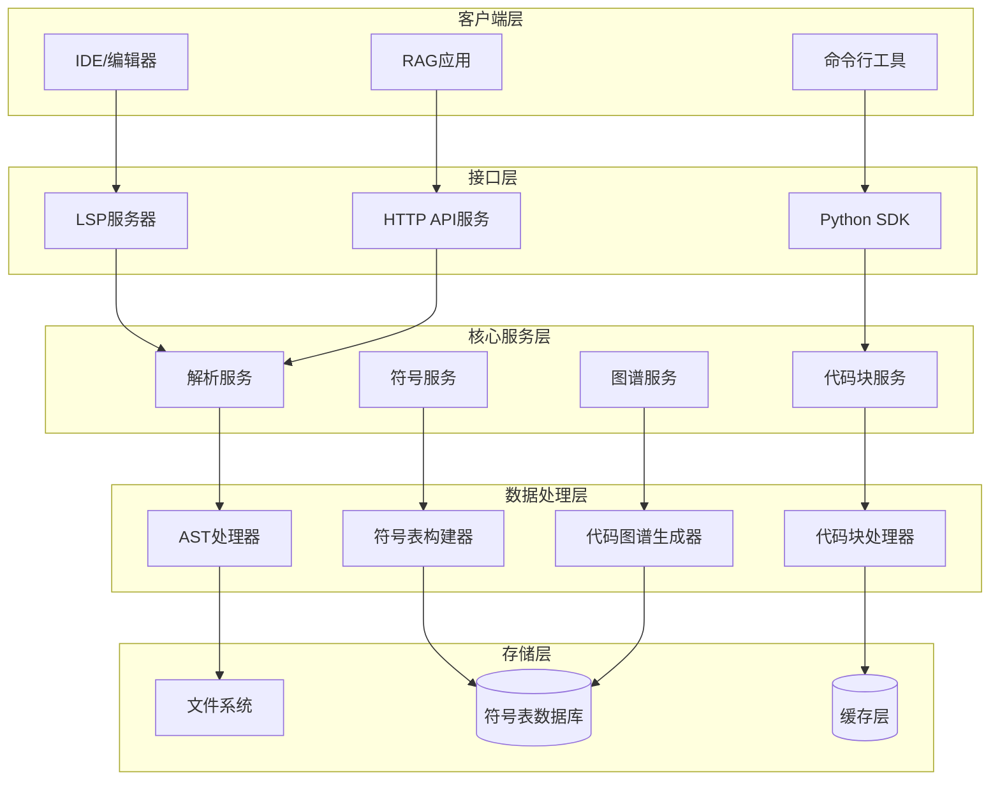
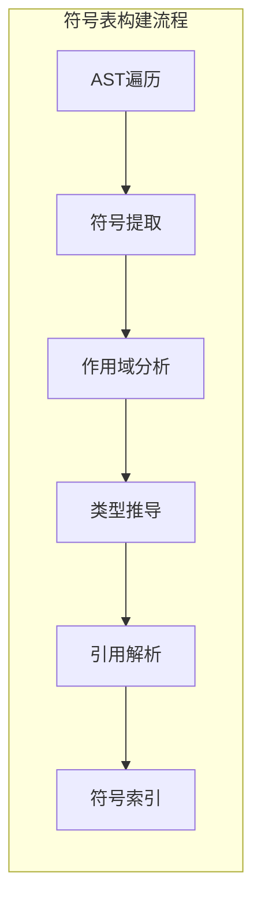
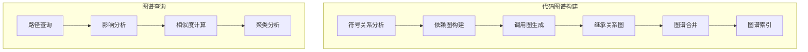
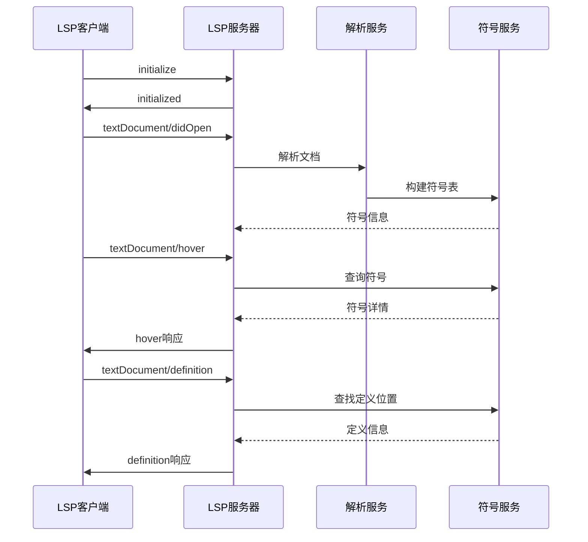
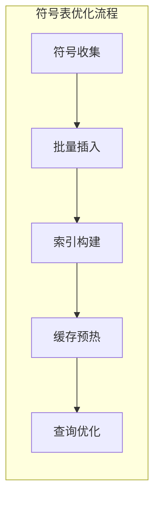
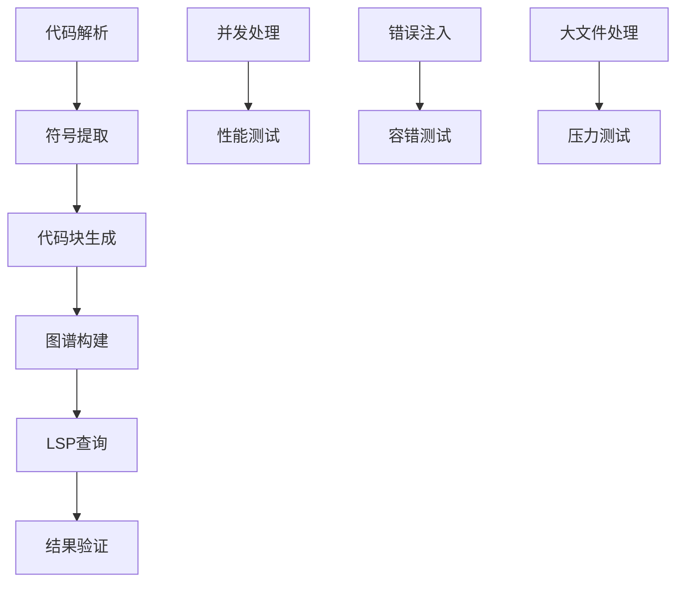

# ArkTS代码处理MVP架构设计

## 概述

本系统是一个基于tree-sitter-arkts-open的ArkTS代码处理平台，旨在为RAG（检索增强生成）应用提供高质量的代码块处理能力。系统采用模块化架构设计，核心功能包括ArkTS代码解析、符号表构建、LSP协议支持以及代码图谱生成，为代码理解和智能分析提供完整的基础设施。

### 核心价值
- **代码智能理解**：通过深度AST解析和符号表分析，提供精确的代码结构理解
- **RAG优化**：生成高质量的代码块分割，提升检索和生成效果
- **可扩展架构**：模块化设计支持未来功能扩展和性能优化
- **标准化接口**：遵循LSP协议，确保与主流IDE和工具的兼容性

## 技术栈与依赖

| 组件类别 | 技术选型 | 用途说明 |
|---------|---------|---------|
| 核心解析器 | tree-sitter-arkts-open | ArkTS语法树解析 |
| 开发语言 | Python 3.9+ | 主要开发语言 |
| AST处理 | tree-sitter-python | Python绑定和AST操作 |
| 符号表存储 | SQLite/PostgreSQL | 符号信息持久化 |
| 协议支持 | pygls | LSP协议实现 |
| 图数据库 | NetworkX | 代码图谱构建 |
| API框架 | FastAPI | HTTP接口服务 |
| 配置管理 | Pydantic | 数据验证和配置 |

## 架构设计

### 系统架构图



### 核心模块架构

#### 1. 解析服务模块（Parser Service）

| 功能组件 | 职责描述 | 输入 | 输出 |
|---------|---------|------|------|
| 语法解析器 | 将ArkTS代码转换为AST | 源代码文本 | 语法树结构 |
| 语义分析器 | 执行类型检查和语义验证 | AST + 上下文 | 语义信息 |
| 错误处理器 | 收集和报告解析错误 | 解析异常 | 错误诊断信息 |
| 缓存管理器 | 管理解析结果缓存 | 文件哈希 | 缓存AST |

#### 2. 符号表服务模块（Symbol Service）



| 符号类型 | 属性字段 | 描述 |
|---------|---------|------|
| 类符号 | name, namespace, members, inheritance | 类定义信息 |
| 方法符号 | name, parameters, return_type, visibility | 方法签名 |
| 变量符号 | name, type, scope, mutability | 变量声明 |
| 接口符号 | name, methods, extends | 接口定义 |
| 模块符号 | name, exports, imports | 模块信息 |

#### 3. 代码块服务模块（Chunk Service）

**代码块分割策略**：

| 分割类型 | 触发条件 | 最大长度 | 重叠策略 |
|---------|---------|---------|---------|
| 语义块 | 完整函数/类 | 1000 tokens | 10% 重叠 |
| 语法块 | AST节点边界 | 500 tokens | 上下文保留 |
| 逻辑块 | 代码逻辑单元 | 800 tokens | 依赖关系保留 |

**代码块元数据结构**：

| 字段名 | 类型 | 描述 |
|-------|------|------|
| chunk_id | String | 唯一标识符 |
| source_file | String | 源文件路径 |
| start_line | Integer | 起始行号 |
| end_line | Integer | 结束行号 |
| chunk_type | Enum | 块类型（类/方法/表达式） |
| symbols | List | 包含的符号列表 |
| dependencies | List | 依赖的其他块 |
| complexity | Float | 代码复杂度评分 |

#### 4. 代码图谱服务模块（CodeGraph Service）



**图谱节点类型**：

| 节点类型 | 属性 | 关系类型 |
|---------|------|---------|
| ClassNode | name, methods, fields | EXTENDS, IMPLEMENTS |
| MethodNode | signature, visibility | CALLS, OVERRIDES |
| VariableNode | type, scope | REFERENCES, ASSIGNS |
| ModuleNode | exports, imports | DEPENDS_ON, EXPORTS |

## LSP协议实现

### 支持的LSP功能

| LSP功能 | 实现状态 | 描述 |
|---------|---------|------|
| textDocument/hover | MVP | 符号信息悬停显示 |
| textDocument/definition | MVP | 跳转到定义 |
| textDocument/references | MVP | 查找引用 |
| textDocument/documentSymbol | MVP | 文档符号树 |
| textDocument/completion | 扩展 | 代码补全 |
| textDocument/semanticTokens | 扩展 | 语义高亮 |
| textDocument/codeAction | 未来 | 代码重构建议 |

### LSP消息流程



## API接口设计

### RESTful API端点

| 端点 | 方法 | 功能 | 请求体 | 响应 |
|------|------|------|--------|------|
| /parse | POST | 解析代码 | {"code": "string"} | AST结构 |
| /symbols | GET | 获取符号 | 查询参数 | 符号列表 |
| /chunks | POST | 生成代码块 | {"code": "string", "strategy": "string"} | 代码块数组 |
| /graph/analyze | POST | 分析代码图谱 | {"files": ["string"]} | 图谱数据 |
| /graph/query | GET | 查询图谱 | 查询参数 | 查询结果 |

### Python SDK接口

```python
# 主要接口类设计（仅展示接口结构，不包含实现）
class ArkTSProcessor:
    """ArkTS代码处理主接口"""
    
    def parse_code(source_code: str) -> ParseResult
    def build_symbol_table(ast_node: ASTNode) -> SymbolTable
    def generate_chunks(source_code: str, strategy: ChunkStrategy) -> List[CodeChunk]
    def analyze_dependencies(file_paths: List[str]) -> DependencyGraph

class SymbolAnalyzer:
    """符号分析器接口"""
    
    def extract_symbols(ast_node: ASTNode) -> List[Symbol]
    def resolve_references(symbol_table: SymbolTable) -> ReferenceMap
    def infer_types(symbol_table: SymbolTable) -> TypeMap

class CodeGraphBuilder:
    """代码图谱构建器接口"""
    
    def build_call_graph(symbol_table: SymbolTable) -> CallGraph
    def build_inheritance_graph(classes: List[ClassSymbol]) -> InheritanceGraph
    def merge_graphs(graphs: List[Graph]) -> CodeGraph
```

## 数据模型设计

### 符号表数据模型

| 表名 | 字段 | 类型 | 描述 |
|------|------|------|------|
| symbols | id, name, type, scope_id, file_path, start_pos, end_pos | 主表 | 符号基础信息 |
| scopes | id, parent_id, type, start_pos, end_pos | 作用域表 | 作用域层次结构 |
| references | id, symbol_id, file_path, position, ref_type | 引用表 | 符号引用关系 |
| types | id, name, definition, generic_params | 类型表 | 类型定义信息 |

### 代码块数据模型

| 字段组 | 字段名 | 数据类型 | 索引 |
|-------|--------|----------|------|
| 标识信息 | chunk_id, file_path, hash | String | Primary, Unique |
| 位置信息 | start_line, end_line, start_char, end_char | Integer | Range Index |
| 内容信息 | content, content_type, language | Text | Full-text Index |
| 元数据 | symbols, imports, exports | JSON | GIN Index |
| 质量指标 | complexity, maintainability, test_coverage | Float | B-tree Index |

## 性能优化策略

### 解析性能优化

| 优化策略 | 实现方式 | 预期提升 |
|---------|---------|---------|
| 增量解析 | 仅重新解析修改的AST子树 | 70%性能提升 |
| 并行处理 | 多文件并行解析 | 50%时间减少 |
| 缓存策略 | 基于文件哈希的AST缓存 | 90%缓存命中 |
| 懒加载 | 按需加载符号详情 | 内存使用减少60% |

### 符号表优化



| 优化维度 | 策略 | 指标目标 |
|---------|------|---------|
| 存储优化 | 符号去重、压缩存储 | 存储空间减少40% |
| 查询优化 | 多级索引、查询缓存 | 查询响应<50ms |
| 更新优化 | 增量更新、批量提交 | 更新效率提升80% |

## 测试策略

### 单元测试覆盖

| 测试模块 | 测试重点 | 覆盖率目标 |
|---------|---------|-----------|
| 解析器测试 | 语法正确性、错误处理 | >95% |
| 符号表测试 | 符号提取、引用解析 | >90% |
| 代码块测试 | 分割策略、边界处理 | >85% |
| LSP测试 | 协议兼容性、响应正确性 | >80% |

### 集成测试场景



### 测试数据集

| 数据集类型 | 数据规模 | 测试目的 |
|-----------|---------|---------|
| 基础语法集 | 100个文件 | 功能正确性验证 |
| 复杂项目集 | 1000个文件 | 性能和稳定性测试 |
| 边界情况集 | 50个文件 | 异常处理验证 |
| 真实项目集 | 开源ArkTS项目 | 实际应用验证 |