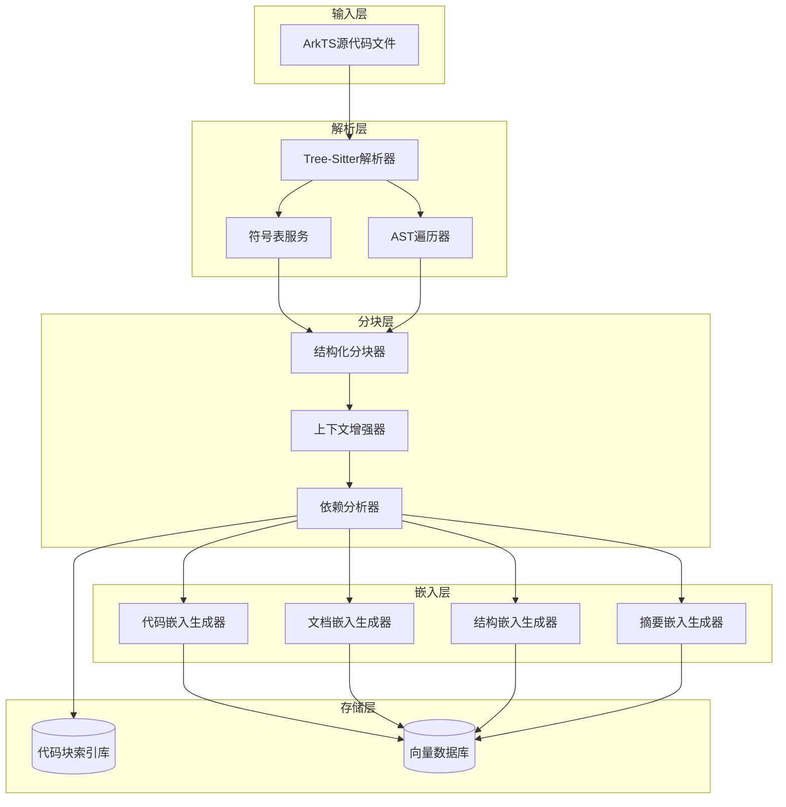
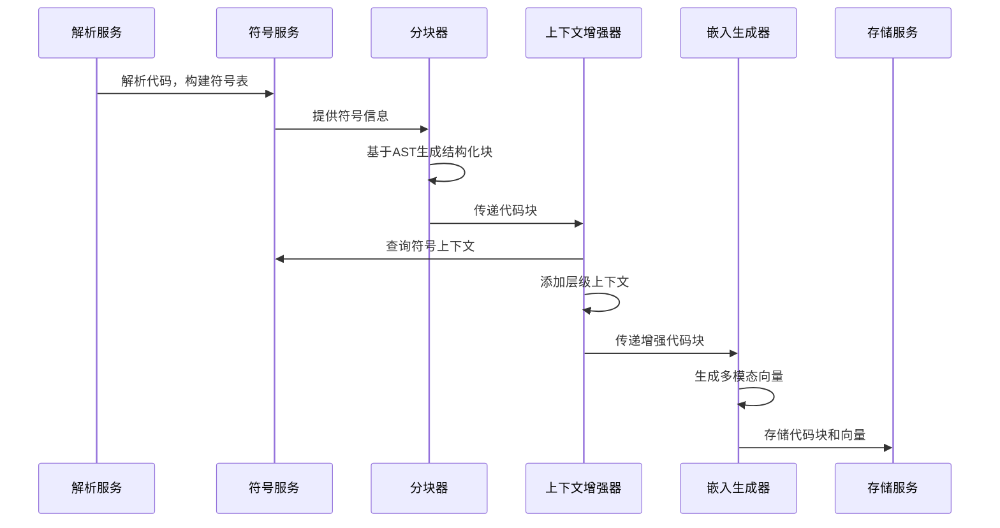
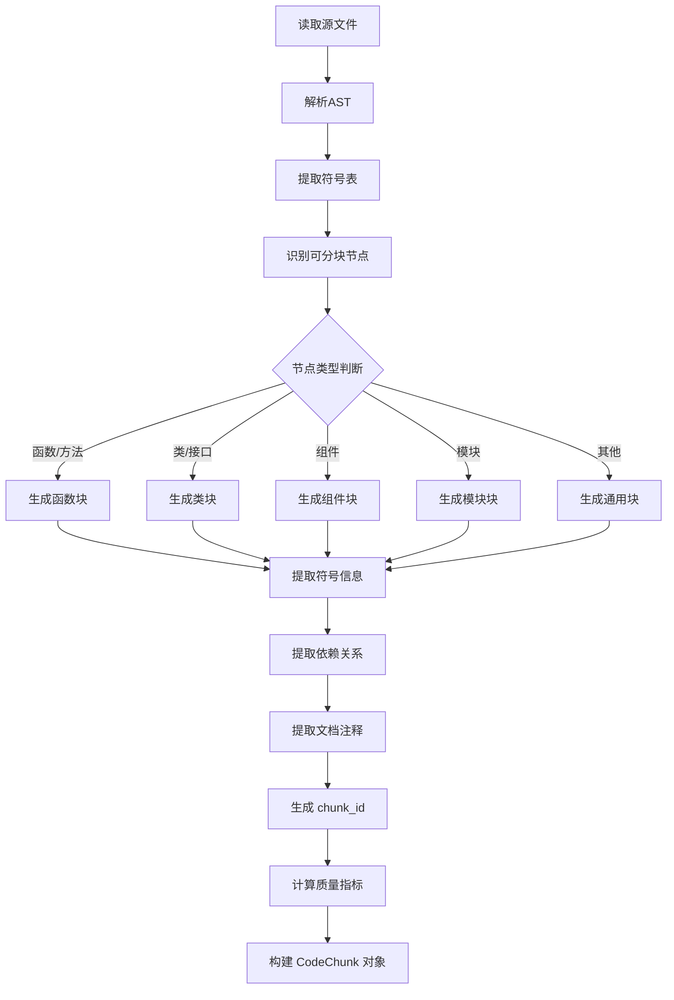

# 增强版代码分块策略设计

## 概述

本设计旨在为 ArkTS 代码处理平台构建增强版代码分块（Chunk）策略，支持基于 AST 的结构化分块、上下文增强以及多模态嵌入视角。该策略将为 RAG（检索增强生成）应用提供高质量的代码块，提升代码检索的精确度和语义理解能力。

### 核心价值

- **语义完整性**：按函数、类、模块等语义单元分块，保证每个 chunk 具有完整的语义边界
- **上下文感知**：为每个 chunk 提供层级上下文信息（文件路径、类名、命名空间等）
- **多视角检索**：通过多模态嵌入支持代码语义、自然语言、结构化信息等多维度检索
- **智能增强**：利用现有符号表服务和 AST 解析能力，自动提取依赖关系和注释信息

### 设计原则

| 原则 | 说明 | 收益 |
|------|------|------|
| AST 驱动 | 基于语法树节点边界分块 | 保证代码完整性，避免语法割裂 |
| 上下文嵌入 | 在 embedding 前添加结构化上下文 | 提升向量检索准确性 |
| 渐进式实现 | 分三阶段逐步增强能力 | 降低实现复杂度，快速验证价值 |
| 可扩展性 | 支持自定义分块策略 | 适应不同场景和需求 |

## 架构设计

### 整体架构

### 核心模块交互

## 阶段 1：结构化代码分块（AST Aware）

### 设计目标

按语义单元（函数、类、模块、文件）生成代码块，每个 chunk 携带完整的元数据信息，使其具备局部语义图能力。

### 分块粒度策略

| 分块类型 | AST 节点类型 | 优先级 | 最大行数 | 描述 |
|---------|-------------|--------|---------|------|
| 函数块 | function_declaration, method_declaration | 高 | 200 | 完整函数/方法定义，包括签名和函数体 |
| 类块 | class_declaration, interface_declaration | 高 | 500 | 完整类/接口定义，包括所有成员 |
| 组件块 | component_declaration (ArkUI) | 高 | 400 | ArkUI 组件定义，包括 build 方法 |
| 模块块 | module, namespace_declaration | 中 | 1000 | 命名空间或模块定义 |
| 枚举块 | enum_declaration | 中 | 100 | 枚举定义及所有成员 |
| 类型块 | type_declaration | 低 | 50 | 类型别名定义 |
| 文件块 | source_file | 低 | 2000 | 整个文件作为一个块（兜底策略） |

### 代码块数据模型

#### CodeChunk 核心结构

| 字段名 | 数据类型 | 必填 | 描述 |
|-------|---------|------|------|
| chunk_id | String | 是 | 唯一标识符，格式：`{file_path}#{symbol_name}` |
| chunk_type | ChunkType | 是 | 块类型（function, class, component, module 等） |
| file_path | String | 是 | 源文件路径 |
| name | String | 是 | 符号名称（函数名、类名等） |
| source_code | String | 是 | 完整源代码文本 |
| range | Range | 是 | 代码范围（起止行列号） |

#### 上下文信息字段

| 字段名 | 数据类型 | 必填 | 描述 |
|-------|---------|------|------|
| parent_context | String | 否 | 父级上下文（类名/命名空间） |
| namespace_path | List[String] | 否 | 命名空间路径 |
| file_relative_path | String | 是 | 项目相对路径 |

#### 语义信息字段

| 字段名 | 数据类型 | 必填 | 描述 |
|-------|---------|------|------|
| symbol_type | SymbolType | 是 | 符号类型（从符号表获取） |
| visibility | Visibility | 否 | 可见性（public/private/protected） |
| modifiers | List[String] | 否 | 修饰符（static, async, abstract 等） |
| documentation | String | 否 | 文档注释/docstring |

#### 依赖关系字段

| 字段名 | 数据类型 | 必填 | 描述 |
|-------|---------|------|------|
| imports | List[String] | 否 | 导入的模块/符号列表 |
| exports | List[String] | 否 | 导出的符号列表 |
| calls | List[String] | 否 | 调用的函数/方法列表 |
| references | List[String] | 否 | 引用的类型/变量列表 |
| extends | List[String] | 否 | 继承的类列表 |
| implements | List[String] | 否 | 实现的接口列表 |

#### ArkUI 特有字段

| 字段名 | 数据类型 | 必填 | 描述 |
|-------|---------|------|------|
| component_type | String | 否 | 组件类型（Entry, Component, Preview） |
| decorators | List[String] | 否 | 装饰器列表（@State, @Prop 等） |
| ui_bindings | List[String] | 否 | UI 组件绑定列表 |
| lifecycle_methods | List[String] | 否 | 生命周期方法列表 |

#### 质量度量字段

| 字段名 | 数据类型 | 必填 | 描述 |
|-------|---------|------|------|
| lines_of_code | Integer | 是 | 代码行数 |
| complexity_score | Float | 否 | 代码复杂度评分 |
| token_count | Integer | 是 | Token 数量（用于 embedding） |

#### 元数据字段

| 字段名 | 数据类型 | 必填 | 描述 |
|-------|---------|------|------|
| created_at | DateTime | 是 | 创建时间 |
| updated_at | DateTime | 是 | 更新时间 |
| version_hash | String | 是 | 内容哈希（用于变更检测） |
| metadata | Dict[String, Any] | 否 | 扩展元数据 |

### 分块生成流程

### 符号信息提取规则

#### 函数/方法块

| 提取内容 | 来源 | 示例 |
|---------|------|------|
| 函数签名 | AST 节点 | `function getUserProfile(id: string): Promise<User>` |
| 参数列表 | 符号表 | `[{name: "id", type: "string"}]` |
| 返回类型 | 符号表 | `Promise<User>` |
| 函数体 | AST 节点文本 | 完整函数实现 |
| 调用关系 | AST 遍历 | `["UserRepo.findById", "AuthService.verify"]` |

#### 类/接口块

| 提取内容 | 来源 | 示例 |
|---------|------|------|
| 类名 | 符号表 | `UserService` |
| 成员列表 | 符号表 | 属性、方法列表 |
| 继承关系 | 符号表 | `extends BaseService` |
| 实现接口 | 符号表 | `implements IUserService` |
| 修饰符 | 符号表 | `abstract`, `static` |

#### ArkUI 组件块

