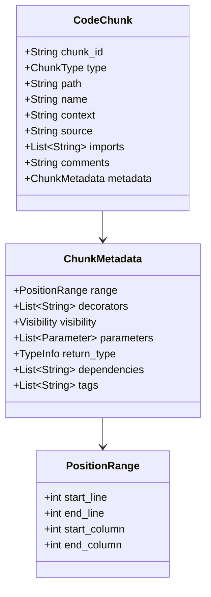
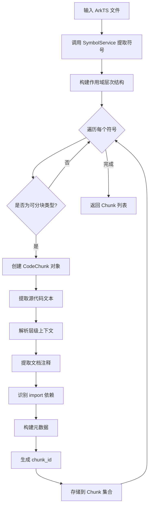
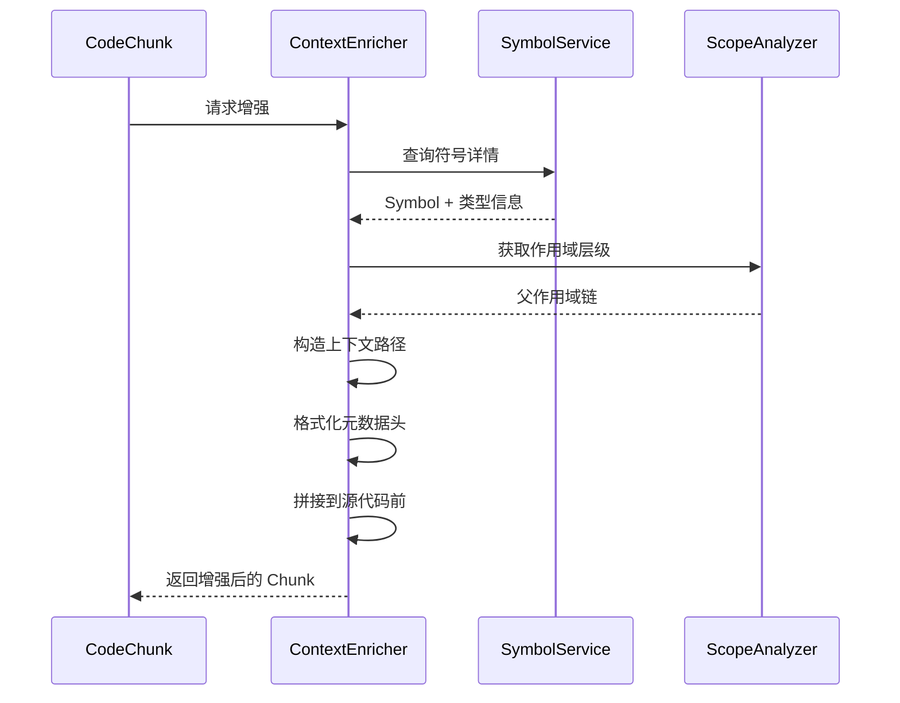
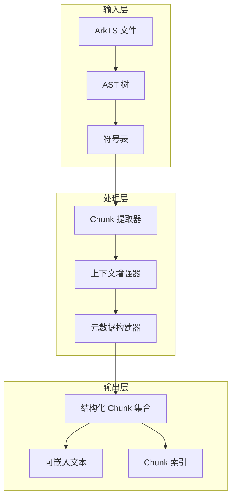
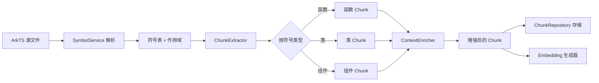
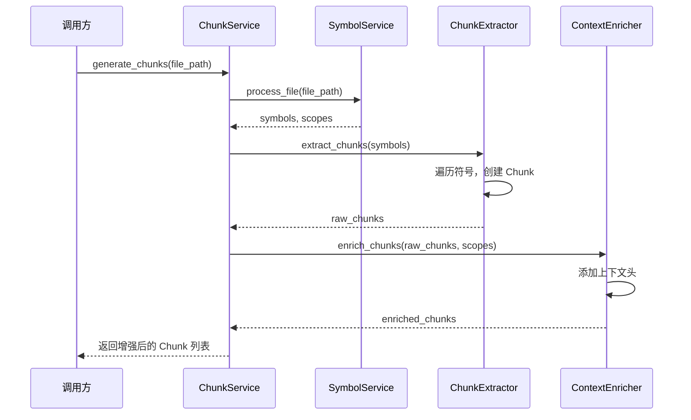
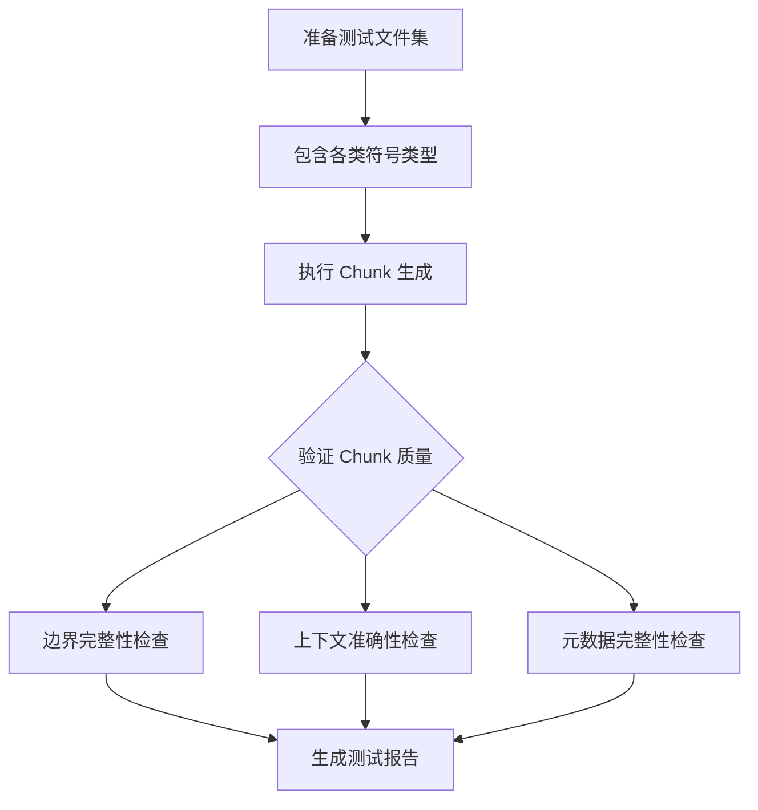
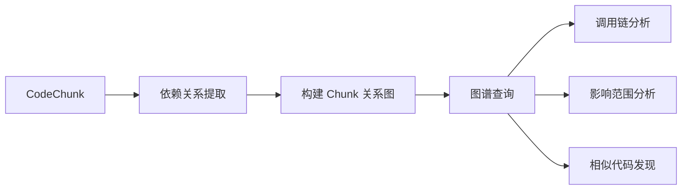

# 增强版代码 Chunk 策略设计

## 概述

本设计提出一套**实用的、AST感知的代码块生成策略**，旨在为RAG（检索增强生成）应用提供高质量的结构化代码块。该策略突破传统固定token窗口分割的局限，基于代码的语义结构（函数、类、模块）生成代码块，并通过上下文增强技术提升嵌入质量。

### 核心设计理念

| 设计原则 | 价值主张 |
|---------|---------|
| **语义完整性** | 代码块边界对齐语义单元，保证逻辑完整性 |
| **上下文感知** | 每个块携带层级上下文（文件→类→函数），增强语义定位能力 |
| **关系可追溯** | 保留imports/调用/继承元数据，支持未来图谱扩展 |
| **自然语言融合** | 整合注释/文档字符串，提升语义检索精度 |

### 应用场景

- **代码语义检索**：在大型代码库中快速定位相关代码
- **上下文感知生成**：为代码生成提供精准上下文
- **智能代码补全**：基于语义理解的智能提示
- **文档自动生成**：从代码结构提取文档信息
- **代码理解辅助**：帮助开发者理解复杂代码逻辑

## 阶段 1：结构化 Chunk（AST Aware）

### 1.1 Chunk 生成策略

系统按照代码的自然语义边界生成代码块，而非机械地按照固定token数分割。

#### Chunk 类型定义

| Chunk 类型 | 语义粒度 | 适用场景 | 优先级 |
|-----------|---------|---------|--------|
| **函数块** | 单个函数/方法 | 独立的功能单元 | 高 |
| **类块** | 完整类定义（包含所有成员） | 类的完整结构 | 高 |
| **组件块** | ArkUI 组件 (@Component struct) | UI组件定义 | 高 |
| **模块块** | 顶层模块/命名空间 | 代码组织单元 | 中 |
| **接口块** | 接口定义 | 类型契约 | 中 |
| **文件块** | 小型工具文件（<200行） | 简单工具类 | 低 |

#### Chunk 数据模型



### 1.2 Chunk 数据结构规范

#### 核心字段定义

| 字段名 | 数据类型 | 描述 | 示例值 |
|-------|---------|------|--------|
| `chunk_id` | String | 唯一标识符：`{文件路径}#{符号路径}` | `"a.ts#MyClass.foo"` |
| `type` | Enum | Chunk类型 | `"function"`, `"class"`, `"component"` |
| `path` | String | 源文件相对路径 | `"src/services/user.ts"` |
| `name` | String | 主符号名称 | `"getUserProfile"` |
| `context` | String | 层级上下文（类名/模块名） | `"UserService"` |
| `source` | String | 完整源代码文本 | `"function foo() { ... }"` |
| `imports` | List[String] | 依赖的外部符号 | `["UserRepo", "AuthService"]` |
| `comments` | String | 文档注释/说明 | `"计算用户得分"` |
| `metadata` | Object | 扩展元数据 | 见 ChunkMetadata 表 |

#### 元数据字段定义

| 字段名 | 数据类型 | 用途说明 |
|-------|---------|---------|
| `range` | PositionRange | 代码在源文件中的位置范围 |
| `decorators` | List[String] | 装饰器列表（如 @Component, @State） |
| `visibility` | String | 访问控制（public/private/protected） |
| `parameters` | List[Parameter] | 函数参数列表及类型信息 |
| `return_type` | TypeInfo | 返回值类型 |
| `dependencies` | List[String] | 直接依赖的其他符号 |
| `tags` | List[String] | 语义标签（如 "async", "lifecycle", "ui-component"） |

### 1.3 Chunk 示例结构

#### 函数 Chunk 示例

```json
{
  "chunk_id": "src/utils/score.ts#calculateUserScore",
  "type": "function",
  "path": "src/utils/score.ts",
  "name": "calculateUserScore",
  "context": "ScoreUtils",
  "source": "function calculateUserScore(user: User, weights: number[]): number { ... }",
  "imports": ["User", "ScoreWeights"],
  "comments": "根据用户行为和权重计算综合得分",
  "metadata": {
    "range": {
      "start_line": 45,
      "end_line": 68,
      "start_column": 0,
      "end_column": 1
    },
    "decorators": [],
    "visibility": "public",
    "parameters": [
      {"name": "user", "type": "User"},
      {"name": "weights", "type": "number[]"}
    ],
    "return_type": {"name": "number", "is_primitive": true},
    "dependencies": ["User", "ScoreWeights", "calculateMetric"],
    "tags": ["pure-function", "calculation"]
  }
}
```

#### ArkUI 组件 Chunk 示例

```json
{
  "chunk_id": "src/views/Login.ets#LoginView",
  "type": "component",
  "path": "src/views/Login.ets",
  "name": "LoginView",
  "context": "@Component",
  "source": "@Component struct LoginView { @State username: string = ''; ... }",
  "imports": ["router", "promptAction"],
  "comments": "用户登录页面组件",
  "metadata": {
    "range": {"start_line": 10, "end_line": 85},
    "decorators": ["@Component", "@Entry"],
    "visibility": "public",
    "parameters": [],
    "return_type": null,
    "dependencies": ["router", "promptAction", "UserService"],
    "tags": ["ui-component", "entry-page", "stateful"]
  }
}
```

### 1.4 Chunk 生成流程



### 1.5 分块规则

| 规则类型 | 规则描述 | 设计目标 |
|---------|---------|---------|
| **边界保持规则** | Chunk 不跨越符号边界 | 保证语义完整性 |
| **单一职责规则** | 一个 Chunk 对应一个主符号 | 明确检索目标 |
| **大小限制规则** | 单个 Chunk 不超过 1000 行代码 | 适配嵌入模型限制 |
| **嵌套处理规则** | 嵌套类/函数创建独立 Chunk | 支持细粒度检索 |
| **重叠策略规则** | 包含必要父上下文，避免重复 | 平衡上下文与效率 |

### 1.6 与现有符号服务的集成

系统复用现有的 `SymbolService`，通过以下映射关系生成 Chunk：

| Symbol 字段 | Chunk 字段 | 转换逻辑 |
|------------|-----------|---------|
| `Symbol.name` | `chunk.name` | 直接映射 |
| `Symbol.symbol_type` | `chunk.type` | 类型转换映射 |
| `Symbol.file_path` | `chunk.path` | 直接映射 |
| `Symbol.range` | `chunk.metadata.range` | 位置信息映射 |
| `Symbol.documentation` | `chunk.comments` | 文档注释映射 |
| `Symbol.decorators` | `chunk.metadata.decorators` | 装饰器列表映射 |
| `Symbol.scope_id` | `chunk.context` | 作用域转上下文路径 |

#### 符号类型到 Chunk 类型映射表

| SymbolType | ChunkType | 说明 |
|-----------|----------|------|
| `FUNCTION` | `function` | 独立函数 |
| `METHOD` | `function` | 类方法（统一为函数块） |
| `CLASS` | `class` | 类定义 |
| `INTERFACE` | `interface` | 接口定义 |
| `COMPONENT` | `component` | ArkUI 组件 |
| `BUILD_METHOD` | `function` | build() 方法 |
| `STYLE_FUNCTION` | `function` | @Styles 样式函数 |
| `ENUM` | `enum` | 枚举类型 |
| `MODULE` | `module` | 模块/命名空间 |

## 阶段 2：上下文增强（Contextual Chunk）

### 2.1 上下文增强策略

在生成 embedding 之前，为每个 Chunk 添加**最小必要上下文**，使 embedding 模型能够捕捉代码的"语义位置"。

#### 核心设计目标

- **位置感知**：明确代码在文件/模块/类中的层级位置
- **依赖可见**：显式声明 imports 和调用关系
- **类型明确**：保留类型签名和返回值信息
- **语义标注**：通过 tags 标识代码的语义特征

### 2.2 上下文模板格式

每个 Chunk 的 `source` 字段在 embedding 前增强为以下格式：

```
# file: {文件路径}
# class: {类名}
# function: {函数名}
# imports: [{导入列表}]
# decorators: [{装饰器列表}]
# tags: [{语义标签}]
# type: {返回类型}

{原始源代码}
```

### 2.3 上下文字段说明

| 上下文字段 | 格式示例 | 用途 |
|-----------|---------|------|
| `file` | `src/services/user_service.ts` | 文件定位 |
| `class` | `UserService` | 所属类（如有） |
| `function` | `getUserProfile` | 主符号名称 |
| `imports` | `[UserRepo, AuthService, Logger]` | 依赖列表 |
| `decorators` | `[@State, @Watch]` | 装饰器（ArkUI） |
| `tags` | `[async, public, lifecycle]` | 语义分类 |
| `type` | `Promise<User>` | 返回类型 |

### 2.4 上下文路径构造规则

`context` 字段提供符号的层级导航路径：

| 路径模式 | 示例 | 适用场景 |
|---------|------|---------|
| 文件级 | `"user_service.ts"` | 模块级符号（顶层函数） |
| 类级 | `"UserService"` | 类成员方法 |
| 嵌套类 | `"OuterClass.InnerClass"` | 深度嵌套结构 |
| 组件级 | `"@Component/LoginView"` | ArkUI 组件 |
| 命名空间 | `"Utils.StringHelper"` | 命名空间下的工具类 |

### 2.5 完整上下文增强示例

#### 普通函数增强示例

**原始 source：**
```typescript
function getUserProfile(id: string): Promise<User> {
  return UserRepo.findById(id);
}
```

**增强后 source：**
```
# file: src/services/user_service.ts
# class: UserService
# function: getUserProfile
# imports: [UserRepo, AuthService]
# decorators: []
# tags: [async, public]
# type: Promise<User>

function getUserProfile(id: string): Promise<User> {
  return UserRepo.findById(id);
}
```

#### ArkUI 组件增强示例

**原始 source：**
```typescript
@Component
struct LoginView {
  @State username: string = '';
  
  build() {
    Column() {
      TextInput({ placeholder: '用户名' })
        .onChange((value) => { this.username = value; })
    }
  }
}
```

**增强后 source：**
```
# file: src/views/Login.ets
# component: LoginView
# decorators: [@Component, @Entry]
# imports: [router, promptAction]
# tags: [ui-component, entry-page, stateful]
# state_vars: [username: string]

@Component
struct LoginView {
  @State username: string = '';
  
  build() {
    Column() {
      TextInput({ placeholder: '用户名' })
        .onChange((value) => { this.username = value; })
    }
  }
}
```

### 2.6 上下文增强流程



### 2.7 ArkUI 特有上下文增强

针对 ArkUI 代码的特殊性，额外保留以下上下文：

| 上下文元素 | 描述 | 示例 |
|-----------|------|------|
| **组件类型** | Entry/Component/Preview 标识 | `@Entry @Component` |
| **状态变量** | 响应式状态声明 | `@State count: number = 0` |
| **生命周期钩子** | 使用的生命周期方法 | `aboutToAppear`, `onPageShow` |
| **事件绑定** | UI 事件处理器 | `onClick`, `onChange` |
| **资源引用** | 引用的资源文件 | `$r('app.string.title')` |

#### ArkUI 增强模板

```
# file: {文件路径}
# component: {组件名}
# component_type: {Entry/Component/Preview}
# decorators: [{装饰器列表}]
# state_vars: [{状态变量列表}]
# lifecycle_hooks: [{生命周期方法}]
# imports: [{导入列表}]
# tags: [{语义标签}]

{原始组件代码}
```

## 架构设计

### 3.1 系统架构图



### 3.2 核心组件设计

#### ChunkExtractor（Chunk 提取器）

**职责**：从符号表提取可分块的代码单元

| 方法 | 输入 | 输出 | 说明 |
|------|------|------|------|
| `extract_chunks` | `List[Symbol]` | `List[CodeChunk]` | 主入口方法 |
| `create_function_chunk` | `Symbol` | `CodeChunk` | 创建函数块 |
| `create_class_chunk` | `Symbol` | `CodeChunk` | 创建类块 |
| `create_component_chunk` | `Symbol` | `CodeChunk` | 创建组件块 |
| `extract_source_code` | `Symbol, source_bytes` | `String` | 提取源码文本 |
| `generate_chunk_id` | `file_path, symbol_path` | `String` | 生成唯一标识 |

#### ContextEnricher（上下文增强器）

**职责**：为 Chunk 添加层级上下文和元数据头

| 方法 | 输入 | 输出 | 说明 |
|------|------|------|------|
| `enrich_chunk` | `CodeChunk` | `CodeChunk` | 增强单个块 |
| `build_context_path` | `Symbol, ScopeAnalyzer` | `String` | 构造上下文路径 |
| `format_metadata_headers` | `CodeChunk` | `String` | 格式化元数据头 |
| `extract_imports` | `Symbol` | `List[String]` | 提取导入依赖 |
| `extract_tags` | `Symbol` | `List[String]` | 提取语义标签 |

#### ChunkMetadataBuilder（元数据构建器）

**职责**：构建 Chunk 的扩展元数据

| 方法 | 输入 | 输出 | 说明 |
|------|------|------|------|
| `build_metadata` | `Symbol` | `ChunkMetadata` | 构建完整元数据 |
| `extract_parameters` | `Symbol` | `List[Parameter]` | 提取参数列表 |
| `extract_return_type` | `Symbol` | `TypeInfo` | 提取返回类型 |
| `extract_decorators` | `Symbol` | `List[String]` | 提取装饰器 |
| `calculate_dependencies` | `Symbol` | `List[String]` | 计算依赖关系 |

### 3.3 数据流设计



## 与现有系统的集成

### 4.1 与 SymbolService 的集成

复用现有的符号提取能力，无需重复解析：

| 现有组件 | 集成方式 | 使用场景 |
|---------|---------|---------|
| `SymbolExtractor` | 直接调用，获取符号列表 | Chunk 提取的数据源 |
| `ScopeAnalyzer` | 查询作用域层级，构造上下文路径 | 上下文增强 |
| `TypeInferenceEngine` | 获取类型信息，用于元数据 | 元数据构建 |
| `ReferenceResolver` | 获取依赖关系 | 依赖分析 |
| `SymbolRepository` | 查询符号详情 | 元数据补充 |

### 4.2 集成流程



## 服务接口设计

### 5.1 ChunkService 主接口

| 方法名 | 参数 | 返回值 | 说明 |
|-------|------|--------|------|
| `generate_chunks` | `file_path: str` | `List[CodeChunk]` | 生成文件的所有 Chunk |
| `generate_chunks_batch` | `file_paths: List[str]` | `Dict[str, List[CodeChunk]]` | 批量生成 |
| `get_chunk_by_id` | `chunk_id: str` | `CodeChunk` | 根据 ID 获取 |
| `search_chunks` | `query: str` | `List[CodeChunk]` | 语义搜索（需嵌入） |
| `get_related_chunks` | `chunk_id: str` | `List[CodeChunk]` | 获取相关 Chunk |

### 5.2 使用场景示例

#### 场景 1：为 RAG 系统生成代码块

**目标**：将代码库转换为可检索的 Chunk 集合

**流程**：
1. 遍历项目所有 ArkTS 文件
2. 调用 `generate_chunks_batch` 批量生成
3. 对每个 Chunk 的增强文本生成 embedding
4. 存储到向量数据库（如 Milvus/Pinecone）
5. 支持用户自然语言查询相关代码

#### 场景 2：代码理解辅助

**目标**：帮助开发者快速理解某个函数的上下文

**流程**：
1. 用户选择某个函数
2. 调用 `get_chunk_by_id` 获取该函数的 Chunk
3. 展示增强后的上下文（所属类、imports、调用关系）
4. 可选：调用 `get_related_chunks` 展示相关代码

#### 场景 3：智能代码补全

**目标**：基于当前上下文提供精准补全建议

**流程**：
1. 获取当前光标位置的 Chunk
2. 根据 `imports` 和 `dependencies` 查找可用符号
3. 结合语义相似度排序候选项
4. 返回补全建议

## 质量保证

### 6.1 Chunk 质量指标

| 指标类型 | 指标名称 | 目标值 | 说明 |
|---------|---------|--------|------|
| **完整性** | 边界对齐率 | >99% | Chunk 不跨越符号边界的比例 |
| **可读性** | 上下文丰富度 | >90% | 包含完整上下文信息的比例 |
| **准确性** | 元数据准确率 | >95% | imports/decorators 提取准确性 |
| **效率** | 生成速度 | <100ms/file | 单文件处理时间 |

### 6.2 测试策略

#### 单元测试覆盖

| 测试模块 | 测试重点 | 覆盖率目标 |
|---------|---------|-----------|
| ChunkExtractor | 各类型符号的 Chunk 生成 | >90% |
| ContextEnricher | 上下文路径构造、元数据头格式化 | >90% |
| MetadataBuilder | 元数据提取准确性 | >85% |

#### 集成测试场景



#### 测试数据集

| 数据集类型 | 文件数 | 用途 |
|-----------|-------|------|
| 基础语法集 | 50 | 验证各类符号的 Chunk 生成 |
| ArkUI 组件集 | 30 | 验证 ArkUI 特有上下文增强 |
| 复杂嵌套集 | 20 | 验证深度嵌套结构处理 |
| 边界情况集 | 15 | 验证异常情况处理 |

## 性能优化

### 7.1 优化策略

| 优化维度 | 策略 | 预期收益 |
|---------|------|---------|
| **解析优化** | 复用 SymbolService 的解析结果 | 避免重复解析 |
| **批量处理** | 文件批量生成，减少 I/O | 提升 50% 吞吐量 |
| **缓存策略** | 缓存已生成的 Chunk（基于文件哈希） | 90% 缓存命中 |
| **并行处理** | 多文件并行生成 | 充分利用多核 CPU |

### 7.2 性能指标

| 场景 | 指标 | 目标值 |
|------|------|--------|
| 单文件生成 | 响应时间 | <100ms |
| 批量生成（100文件） | 总耗时 | <5s |
| 大文件处理（>1000行） | 处理时间 | <500ms |
| 内存占用 | 峰值内存 | <200MB（1000文件） |

## 未来扩展

### 8.1 扩展方向

| 扩展功能 | 描述 | 优先级 |
|---------|------|--------|
| **语义嵌入集成** | 自动生成 Chunk 的向量表示 | 高 |
| **增量更新** | 支持文件修改后增量更新 Chunk | 高 |
| **相似度计算** | 基于嵌入计算 Chunk 相似度 | 中 |
| **代码图谱扩展** | 将 Chunk 依赖关系可视化 | 中 |
| **多语言支持** | 扩展到 TypeScript/JavaScript | 低 |

### 8.2 与代码图谱的融合



| 图谱能力 | 基于 Chunk 的实现 | 应用场景 |
|---------|------------------|---------|
| **调用链追踪** | 通过 `dependencies` 构建调用图 | 代码影响分析 |
| **继承关系图** | 通过 `extends`/`implements` | 类层次理解 |
| **模块依赖图** | 通过 `imports` 聚合 | 架构可视化 |
| **相似代码聚类** | 基于 embedding 相似度 | 代码复用发现 |
